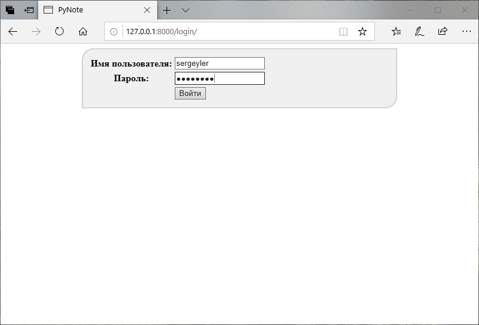
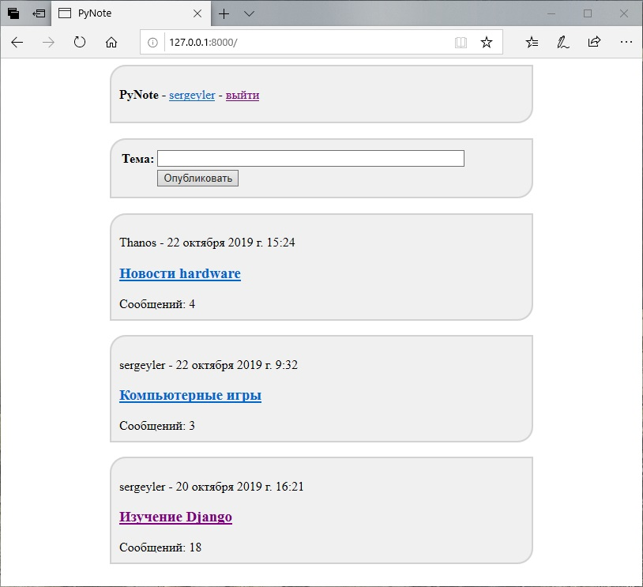
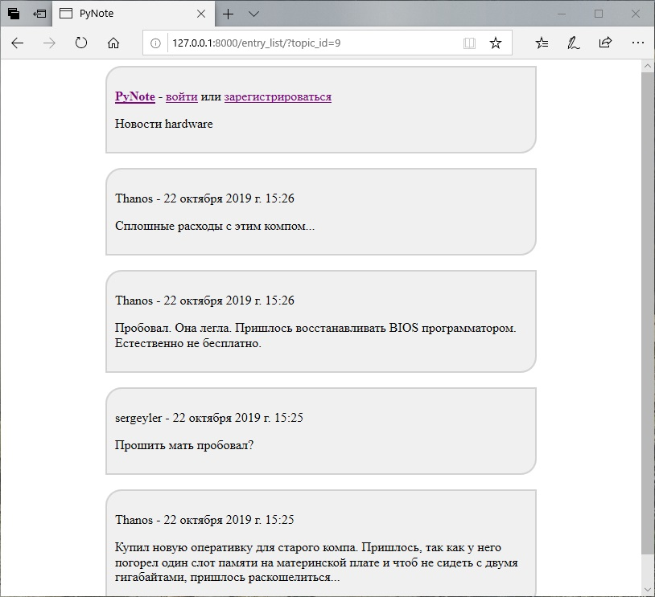
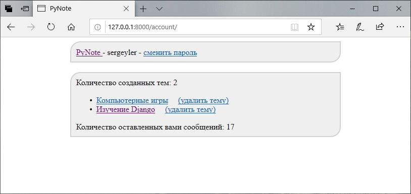

# PyNote
Форум на Django

Моё первое web-приложение на Python (Django). Простой форум. Целью этого проекта было отработать основные приемы работы с Django - создание контроллеров (функций и классов), создание и работу с шаблонами, работу с моделями (создание, выборка списка объектов), работу с учетными записями (создание и изменение паролей).
Скриншоты проекта ниже: 

